# EE538 Final Project - Summer 2022 - TrojanMap

The project is **optional**: you can select one of the following options:

1. Work on the project and submit the reports.
2. Submit homework assignments (HW4, 5, 6).

If you chose to work on the project, you don't have to submit the remaining homework assignments. Similarly, if you chose to work on the homework assignment, you do not have to submit the project. 

You should inform us of your choice by the first due date (Friday July 8).

#### Who should work on the project?
If you plan to become a software engineer, we recommend to work on the project as it will give you more experience in coding a real life project. Otherwise, you can take the homework assignments.

Not everything in the project is covered in the class. The idea is for you to do some quick research and figure them out. For example, you should read on handling regular expressions in C++.

#### Which one is harder?
We expect both options to take similar amount of time. The project however might require extra effort from you during the environment setup and installing prerequisites.

#### How many students in each team?
Each team should consist of one or two students. You can find team-mates from who are in other sections of the course.  You should select your teammates by the first due date (July 8).

#### What should I submit?
The project is submitted in different phases. You are required to submit the following:

1. Phase 1, 2, and 3: these should be submitted on github.
2. Video presentation: you and your team mate will create a 3-4 minute video, post it as an unlisted video on Youtube and submit the link. The video should include:
   - Teammates introduction
   - Demo of the executable
   - Quick overview of the algorithm and code architecture
   - Tables, plots and comparisons
   - No coding details in the video.

https://youtu.be/yoau9mpF6rM


3. Final report in the README file of your github submission. The final report should include the questions that are asked in this README file, your tables and plots for the runtime results, and any other detail of your code.


## Due Dates

- Phase 1: Friday, July 8, 23:59 pm
- Phase 2: Friday, July 15, 23:59 pm
- Phase 3: Friday, July 22, 23:59 pm
- Video Presentation: Friday, July 29, 23:59 pm
- Report: Friday, Aug 5, 23:59 pm


## TrojanMap

This project focuses on using data structures in C++ and implementing various graph algorithms to build a map application.

<p align="center"></p>

- Please clone the repository, read through [README.md](README.md) and implement the functions of the project.
- Please make sure that your code can run `bazel run` and `bazel test`.
- You need to fill in [trojanmap.cc](src/lib/trojanmap.cc), [mapui.cc](src/lib/mapui.cc) and maybe [mapui.h](src/lib/mapui.h), and add unit tests in the `tests` directory.
- We will use autograder to grade some of the questions

---

## The Data Structure

Each point on the map is represented by the class **Node** shown below and defined in [trojanmap.h](src/lib/trojanmap.h).

```cpp
class Node {
 public:
  Node(){};
  Node(const Node &n) {
    id = n.id;
    lat = n.lat;
    lon = n.lon;
    name = n.name;
    neighbors = n.neighbors;
    attributes = n.attributes;
  };
  std::string id;    // A unique id assign to each point
  double lat;        // Latitude
  double lon;        // Longitude
  std::string name;  // Name of the location. E.g. "Bank of America".
  std::vector<std::string>
      neighbors;  // List of the ids of all neighbor points.
  std::unordered_set<std::string>
      attributes;  // List of the attributes of the location.
};
```

---

## Prerequisites
The details of environment setup will be reviewed in the discussion session. Please do not miss that class!

### External Libraries Installation

For visualization, we use `OpenCV` library. You will use this library as a black box and don't need to worry about the graphic details. Use the following commands to install OpenCV and other libraries.

#### For Macos Users

Step 1. type the following three lines in your terminal
```shell
$ brew install cmake
$ brew install opencv
$ brew install ncurses
```

Step 2.

Check the installation paths of opencv and ncurses by

```shell
brew info opencv
```

and

```shell
brew info ncurses
```

respectively, and update their paths in the `WORKSPACE` file of your project root directory with the actual installation paths


#### For Ubuntu users
Step 1. 
```shell
$ cd **your project folder**
$ git clone https://github.com/opencv/opencv.git
$ sudo apt-get install cmake libgtk2.0-dev pkg-config
$ sudo apt install libcanberra-gtk-module libcanberra-gtk3-module
$ sudo apt-get install libncurses5-dev libncursesw5-dev
$ cp ubuntu/* ./
```

Step 2. Make sure you set the **path_to_install_folder** to be the absolute path to the **install** folder under opencv when running the following commands

```shell
$ cd opencv/
$ mkdir build install
$ cd build
$ cmake -D CMAKE_INSTALL_PREFIX=**path_to_install_folder** -D BUILD_LIST=core,highgui,imgcodecs,imgproc,videoio ..
$ make install
```

For example, if cloned this repo under `"/Users/ari/github/TrojanMap"`, you should type:

```shell
$ cd opencv/
$ mkdir build install
$ cd build
$ cmake -D CMAKE_INSTALL_PREFIX=/Users/ari/github/TrojanMap/opencv/install -D BUILD_LIST=core,highgui,imgcodecs,imgproc,videoio ..
$ make install
```

## Run the program

For MacOS users, run

```shell
$ bazel run src/main:main
```

For Ubuntu users, run
               
```shell
$ bazel run --cxxopt='-std=c++17' src/main:main
```

If everything is correct, a menu similar to this will show up.

```shell
TrojanMap Menu
**************************************************************
* Enter the function number (1-11) to start:                  
* 1. Autocomplete                                             
* 2. Find the location                                        
* 3. Find all location categories                             
* 4. Get all locations of a category                          
* 5. Get location matching regular expression                 
* 6. CalculateShortestPath                                    
* 7. Cycle Detection                                          
* 8. Topological Sort                                         
* 9. Traveling salesman problem                              
* 10. Find Nearby                                              
* 11. Exit                                                     
**************************************************************
```

## Test The Program

We created some tests for you to test your program, please run
```shell
$ bazel test tests:trojanmap_test
```

Please add you test in the [trojanmap_test_student.cc](tests/trojanmap_test_student.cc) and run

```shell
$ bazel test tests:trojanmap_test_student
```

## Item 1: Autocomplete The Location Name (Phase 1)

```c++
std::vector<std::string> Autocomplete(std::string name);
```

We consider the names of nodes as the locations. Implement a method to type the partial name of the location and return a list of possible locations with partial name as prefix. Please treat uppercase and lower case as the same character.

Method:
1. We traverse all nodes in the map.
   
2. We transform the lower letters to upper letters.
3. Skip the nodes whose size are less than the size of input.
4. Compare the nodes that have same letters of input from beginning.
   
Example:

Input: "Chi" \
Output: ["Chick-fil-A", "Chipotle", "Chinese Street Food"]

Example:

```shell
**************************************************************
* 1. Autocomplete                                             
**************************************************************

Please input a partial location:ch
*************************Results******************************
Chinese Street Food
Cheebos Burger
Chick-fil-A
Chase
Chevron 1
Chipotle
Chase Plaza Heliport
Chevron 2
Church of Christ
Chucks Chicken & Waffles
Chevron
**************************************************************
Time taken by function: 2 ms
```
Example 1:
```
* 1. Autocomplete                                             
**************************************************************

Please input a partial location:Ral
*************************Results******************************
Ralphs
**************************************************************
Time taken by function: 6 ms
```
Example 2:
```
* 1. Autocomplete                                             
**************************************************************

Please input a partial location:Te 
*************************Results******************************
No matched locations.
**************************************************************
Time taken by function: 7 ms
```
Example 3:
```
* 1. Autocomplete                                             
**************************************************************

Please input a partial location:Ta
*************************Results******************************
Tap Two Blue
Target
**************************************************************
Time taken by function: 5 ms
```
- What is the runtime of your algorithm? 
 Ans: We need to traverse all nodes in the data, so the time complexity is O(n).
- (Optional) Can you do it faster than `O(n)`?

## Item 2-1: Find the place's coordinates in the Map (Phase 1)

```c++
std::pair<double, double> GetPosition(std::string name);
```

Given a location name, return the latitude and longitude. There are no duplicated location names. You should mark the given locations on the map. If the location does not exist, return (-1, -1). The algorithm is case-sensitive.

Method:
1. We traverse all nodes in the map.
2. Return the lat and lon of the input node.

Example:

Input: "Target" \
Output: (34.0257016, -118.2843512)

```shell
**************************************************************
* 2. Find the position                                        
**************************************************************

Please input a location:Target
*************************Results******************************
Latitude: 34.0257 Longitude: -118.284
**************************************************************
Time taken by function: 1 ms
```

<p align="center"></p>

Example 1:
```
* 2. Find the location                                        
**************************************************************

Please input a location:Chase
*************************Results******************************
Latitude: 34.0223 Longitude: -118.28
**************************************************************
Time taken by function: 5 ms
```
<p align="center">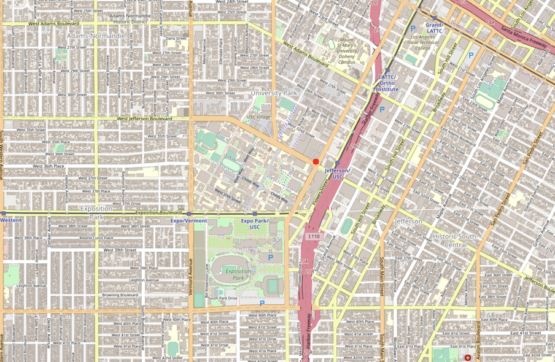</p>

Example 2:
```
* 2. Find the location                                        
**************************************************************

Please input a location:Ralphs
*************************Results******************************
Latitude: 34.0318 Longitude: -118.291
**************************************************************
Time taken by function: 1 ms
```
<p align="center">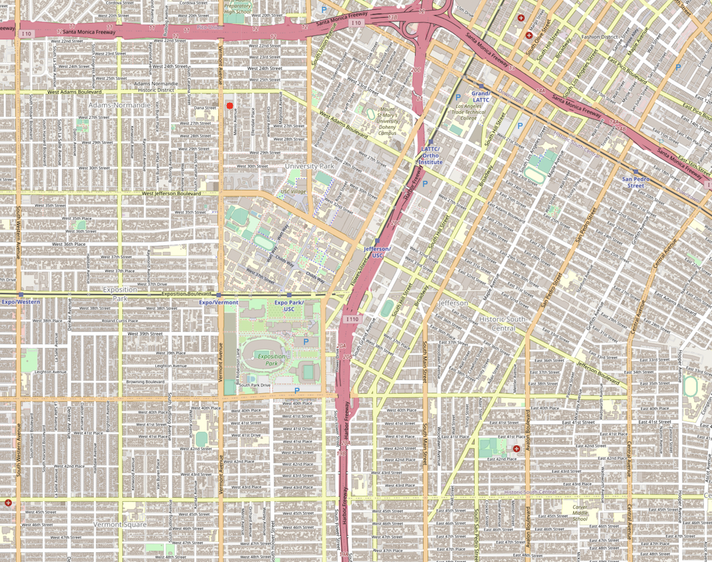</p>

Example 3:
```
* 2. Find the location                                        
**************************************************************

Please input a location:Shell
*************************Results******************************
Latitude: 34.0034 Longitude: -118.283
**************************************************************
Time taken by function: 4 ms
```
<p align="center">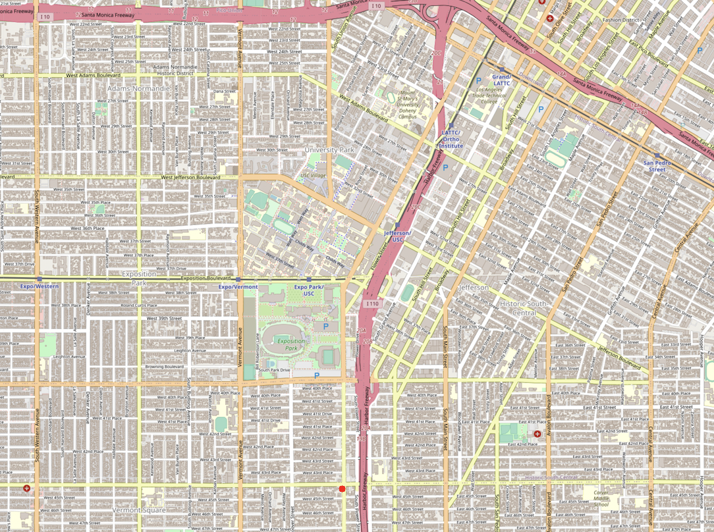</p>

## Item 2-2: Check Edit Distance Between Two Location Names (Phase 2)

```c++
int CalculateEditDistance(std::string name1, std::string name2);
```

When entering a location name that does not exist in the map, your program should determine whether the input can be replaced with a "similar name" or not. By "similar names" we mean the names that exist in the map with a *smallest distance* from the original input. 

The distance between two names A and B is the minimum number of operations required to convert A to B. There are 3 operations:
+ Insert a character
+ Delete a character
+ Replace a character

If the exact match is found, it will be shown on the map. Otherwise, the map will show the most similar name by using FindClosestName and print a warning. 

For example, if I type *Rolphs*, I should get a warning like "Did you mean *Ralphs* instead of *Rolphs*?". 

Write a dynamic programming solution to calculate edit distance. 

Method:
1. For two different strings, we can use the previous edit state as a base and then move to the next edit state by deleting, inserting or swapping until the two strings are exactly the same.
2. In each editing operation, we only select the process with the least number of steps.
3. We use a two-dimensional matrix to record each edit state of the two strings, and finally we get the minimum edit distance through iteration.

```c++
std::string FindClosestName(std::string name);
```

Notes:
- Space can be treated like other characters.
- Spell checking part should be case insensitive.

Example:

Input: "Rolphs", "Ralphs" \
Output: 1


In the user interface of your program, you should show the names that have the minimum edit distance to the name that the user entered.

Method:
1. Through traversal, calculate the edit distance between the input and the name of each node.
2. Find the one with the smallest distance as the output.


Example 1:
```
Input: "Rolphs"\
Output: "Ralphs"

**************************************************************
* 2. Find the location                                        
**************************************************************

Please input a location:Rolphs
*************************Results******************************
No matched locations.
Did you mean Ralphs instead of Rolphs? [y/n]y
Latitude: 34.0318 Longitude: -118.291
**************************************************************
Time taken by function: 2 ms
```
Example 2:
```
* 2. Find the location                                        
**************************************************************

Please input a location:chaaase
*************************Results******************************
No matched locations.
Did you mean Chase instead of chaaase? [y/n]y
Latitude: 34.0223 Longitude: -118.28
**************************************************************
Time taken by function: 4 ms
```
## Item 3: Get All Categories (Phase 2)

```c++
std::vector<std::string> GetAllCategories();
```

Some of the locations have category types (`attributes` field in `data.csv` file). 

In this section, your program should print all available categories among all existing categories in the map. There should be no duplicates in the output.

Method:
1. All the location categories are obtained by traversing.
2. By combining the three functions including sort, unique and erase, the output categories will not be repeated.

Example:
```
* 3. Find all location categories                             
**************************************************************

*************************Results******************************
artwork
attraction
bakery
bank
bar
beauty
beverages
bicycle
bicycle_rental
bus_station
cafe
car
car_repair
car_wash
charging_station
childcare
clinic
clothes
confectionery
convenience
copyshop
dentist
department_store
driving_school
fabric
fast_food
food_court
fountain
fuel
gallery
hairdresser
hospital
hotel
library
marketplace
mobile_phone
museum
music
optician
parcel_locker
parking
parking_entrance
pharmacy
place_of_worship
police
post_box
post_office
restaurant
school
shoe_repair
shoes
skate
social_facility
supermarket
theatre
tobacco
yes
yoga
size of categories is : 58
**************************************************************
Time taken by function: 5 ms
```

## Item 4: Get All Locations In A Category (Phase 2)

```c++
std::pair<double, double> GetAllLocationsFromCategory(std::string category);
```

In this section if the user entries a category, the program prints all locations that match that category. For example, if there is a category called "Grocery", your program should print all locations that match the "Grocery" category. 

Method:
1. Find the same category as the input by traversing, and output the coordinates of all corresponding nodes.

Example 1:
```
* 4. Get all locations in a category                           
**************************************************************

Please input a category (eg:fuel):fuel
*************************Results******************************
(34.0324, -118.3)
(34.0358, -118.291)
(34.0246, -118.25)
(34.0336, -118.262)
(34.004, -118.283)
(34.0034, -118.283)
(34.0354, -118.284)
(34.018, -118.309)
(34.0107, -118.282)
size of locations from categories is : 9
**************************************************************
Time taken by function: 5 ms
```
Example 2:
```
* 4. Get all locations in a category                           
**************************************************************

Please input a category (eg:fuel):cafe
*************************Results******************************
(34.0354, -118.253)
(34.0245, -118.284)
(34.0172, -118.282)
(34.0247, -118.288)
(34.0186, -118.282)
(34.0391, -118.261)
(34.019, -118.288)
(34.0254, -118.285)
(34.0213, -118.282)
(34.0195, -118.282)
size of locations from categories is : 10
**************************************************************
Time taken by function: 4 ms
```

## Item 5: Get Locations Using A Regular Expression (Phase 2)

```c++
std::pair<double, double> GetLocationRegex(std::regex location);
```

In this section if the user enters a [regular expression](https://en.wikipedia.org/wiki/Regular_expression), they should see all locations that match that regular expression.

Your program should also verify if the input regular expression was correct.

Method:
1. Verify that the regular expression is correct by traversing and combining the regex_match function, and find the name of the matching node and finally output the corresponding coordinates.

Example 1:
```
* 5. Get locations using a regular expression                 
**************************************************************

regular expression of a location's name eg(R.*):R.*
*************************Results******************************
Rock & Reillys: 34.0243, -118.284
Rossoblu: 34.035, -118.254
Rite Aid: 34.0286, -118.261
Ralphs: 34.0318, -118.291
Roger Williams Baptist Church: 34.0325, -118.29
Ross: 34.0044, -118.282
Redeemer Missionary Baptist Church: 34.033, -118.298
Ramen KenJo: 34.025, -118.285
Rite Aid 1: 34.0049, -118.282
**************************************************************
Time taken by function: 41 ms
```
Example 2:
```
* 5. Get locations using a regular expression                 
**************************************************************

regular expression of a location's name eg(R.*):Ro.+
*************************Results******************************
Rock & Reillys: 34.0243, -118.284
Rossoblu: 34.035, -118.254
Roger Williams Baptist Church: 34.0325, -118.29
Ross: 34.0044, -118.282
**************************************************************
Time taken by function: 40 ms
```
Example 3:
```
* 5. Get locations using a regular expression                 
**************************************************************

regular expression of a location's name eg(R.*):rx+
*************************Results******************************
not match !
**************************************************************
Time taken by function: 36 ms
```


## Item 6: CalculateShortestPath between two places (Phase 2)

```c++
std::vector<std::string> CalculateShortestPath_Dijkstra(std::string &location1_name,
                                               std::string &location2_name);
std::vector<std::string> CalculateShortestPath_Bellman_Ford(std::string &location1_name,
                                               std::string &location2_name);
```

Given 2 locations A and B, find the best route from A to B. The distance between 2 points is the euclidean distance using latitude and longitude. You should use both Dijkstra algorithm and Bellman-Ford algorithm. Compare the time for the different methods. Show the routes on the map. If there is no path, please return empty vector.

Please report and compare the time spent by these algorithms.

Method of Dijkstra:
1. We use priority queue to store minimum distance, path to store IDs, and mark the visited node as 2, being visited node as 1.
2. Set the initial distance as 0.0 and make pair to the initial node.
3. Pop out the min distance; then traverse all the neighbor nodes. Compare the new distance with the old distance and store the smaller one. We need to avoid the infinite loop(0 distance or negative distance). We use pre to store previous node.
4. Do the loop until we visit all the nodes.
   
Method of Bellman-Ford:
1. First initialize the distances from all nodes to the starting point, set the distance from the starting point to itself to 0, and set the rest of the distances to infinity.
2. A map named prefixor_map is set to record the previous node corresponding to each node in the path, which can facilitate us to output the final path result.
3. Relax each edge until the length of each edge reaches the minimum.

**You should create a table like below, which includes the runtime of the algorithm for several examples.**
| Point A to Point B      | Dijkstra | Bellman Ford| Bellman Ford optimized|
| -------------------- | ----------- |-------|-----|
|                      |  t1         | t2    |   t3  |

Reason: the time complexity of Dijkstra is O(m logn + n logn), and the time complexity of Bellman_Ford is O(n*m). When the number of nodes is large like here 18359, the time between them has a huge difference. And because we can stop early, the longer the path is, the longer the running time will be.

Example
```
**************************************************************
* 6. CalculateShortestPath                                    
**************************************************************

Please input the start location:Ralphs
Please input the destination:Target
*************************Dijkstra*****************************
*************************Results******************************
"2578244375","4380040154","4380040158","4380040167","6805802087","8410938469","6813416131","7645318201","6813416130","6813416129","123318563","452688940","6816193777","123408705","6816193774","452688933","452688931","123230412","6816193770","6787470576","4015442011","6816193692","6816193693","6816193694","4015377691","544693739","6816193696","6804883323","6807937309","6807937306","6816193698","4015377690","4015377689","122814447","6813416159","6813405266","4015372488","4015372487","6813405229","122719216","6813405232","4015372486","7071032399","4015372485","6813379479","6813379584","6814769289","5237417650",
The distance of the path is:0.927969 miles
**************************************************************
Time taken by function: 39 ms

*************************Bellman_Ford*************************
*************************Results******************************
"2578244375","4380040154","4380040158","4380040167","6805802087","8410938469","6813416131","7645318201","6813416130","6813416129","123318563","452688940","6816193777","123408705","6816193774","452688933","452688931","123230412","6816193770","6787470576","4015442011","6816193692","6816193693","6816193694","4015377691","544693739","6816193696","6804883323","6807937309","6807937306","6816193698","4015377690","4015377689","122814447","6813416159","6813405266","4015372488","4015372487","6813405229","122719216","6813405232","4015372486","7071032399","4015372485","6813379479","6813379584","6814769289","5237417650",
The distance of the path is:0.927969 miles
**************************************************************
Time taken by function: 7084 ms
```

<p align="center"></p>

Example 1:
```
* 6. CalculateShortestPath                                    
**************************************************************

Please input the start location:Ralphs
Please input the destination:Target
*************************Dijkstra*****************************
*************************Results******************************
"2578244375","4380040154","4380040158","4380040167","6805802087","8410938469","6813416131","7645318201","6813416130","6813416129","123318563","452688940","6816193777","123408705","6816193774","452688933","452688931","123230412","6816193770","6787470576","4015442011","6816193692","6816193693","6816193694","4015377691","544693739","6816193696","6804883323","6807937309","6807937306","6816193698","4015377690","4015377689","122814447","6813416159","6813405266","4015372488","4015372487","6813405229","122719216","6813405232","4015372486","7071032399","4015372485","6813379479","6813379584","6814769289","5237417650",
The distance of the path is:0.927969 miles
**************************************************************
Time taken by function: 58 ms

*************************Bellman_Ford*************************
*************************Results******************************
"2578244375","4380040154","4380040158","4380040167","6805802087","8410938469","6813416131","7645318201","6813416130","6813416129","123318563","452688940","6816193777","123408705","6816193774","452688933","452688931","123230412","6816193770","6787470576","4015442011","6816193692","6816193693","6816193694","4015377691","544693739","6816193696","6804883323","6807937309","6807937306","6816193698","4015377690","4015377689","122814447","6813416159","6813405266","4015372488","4015372487","6813405229","122719216","6813405232","4015372486","7071032399","4015372485","6813379479","6813379584","6814769289","5237417650",
The distance of the path is:0.927969 miles
**************************************************************
Time taken by function: 14488 ms
```
<p align="center">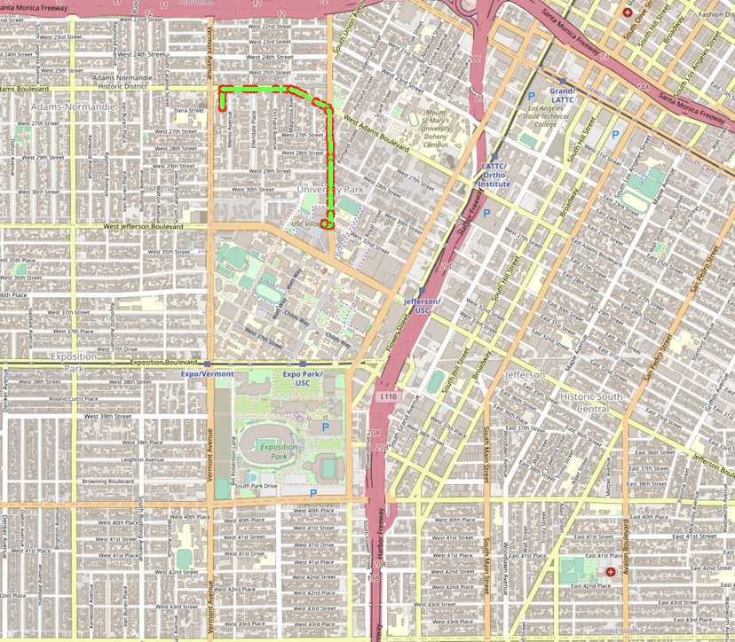</p>

Example 2:
```
* 6. CalculateShortestPath                                    
**************************************************************

Please input the start location:Chase
Please input the destination:Ralphs
*************************Dijkstra*****************************
*************************Results******************************
"9591449441","9559739232","3398574883","6045067409","9559739236","3402917919","3402917921","3872400990","6818390146","6813379456","6807200381","9591449452","6813379408","2783295153","544671962","6813379439","6813379467","6813360938","5237377002","5237400231","6047234445","6813360983","6813360984","6045054380","6813379385","6813379474","6813379475","6818390144","6818390145","6813405201","6813405202","6813405203","6813405204","6813405205","6813405206","123318572","5565967545","7811699597","6817230310","3642819026","6817230316","2613117861","6818390170","6818390171","6818390172","6807374562","2613117885","6818390165","2613117882","6818390178","2613117902","6813416153","6813416154","6813416145","7232024780","6818427916","6818427917","6818427898","6818427892","6818427918","6818427919","6818427920","4380040148","4380040152","4380040153","4380040154","2578244375",
The distance of the path is:1.25601 miles
**************************************************************
Time taken by function: 152 ms

*************************Bellman_Ford*************************
*************************Results******************************
"9591449441","9559739232","3398574883","6045067409","9559739236","3402917919","3402917921","3872400990","6818390146","6813379456","6807200381","9591449452","6813379408","2783295153","544671962","6813379439","6813379467","6813360938","5237377002","5237400231","6047234445","6813360983","6813360984","6045054380","6813379385","6813379474","6813379475","6818390144","6818390145","6813405201","6813405202","6813405203","6813405204","6813405205","6813405206","123318572","5565967545","7811699597","6817230310","3642819026","6817230316","2613117861","6818390170","6818390171","6818390172","6807374562","2613117885","6818390165","2613117882","6818390178","2613117902","6813416153","6813416154","6813416145","7232024780","6818427916","6818427917","6818427898","6818427892","6818427918","6818427919","6818427920","4380040148","4380040152","4380040153","4380040154","2578244375",
The distance of the path is:1.25601 miles
**************************************************************
Time taken by function: 17901 ms
```
<p align="center">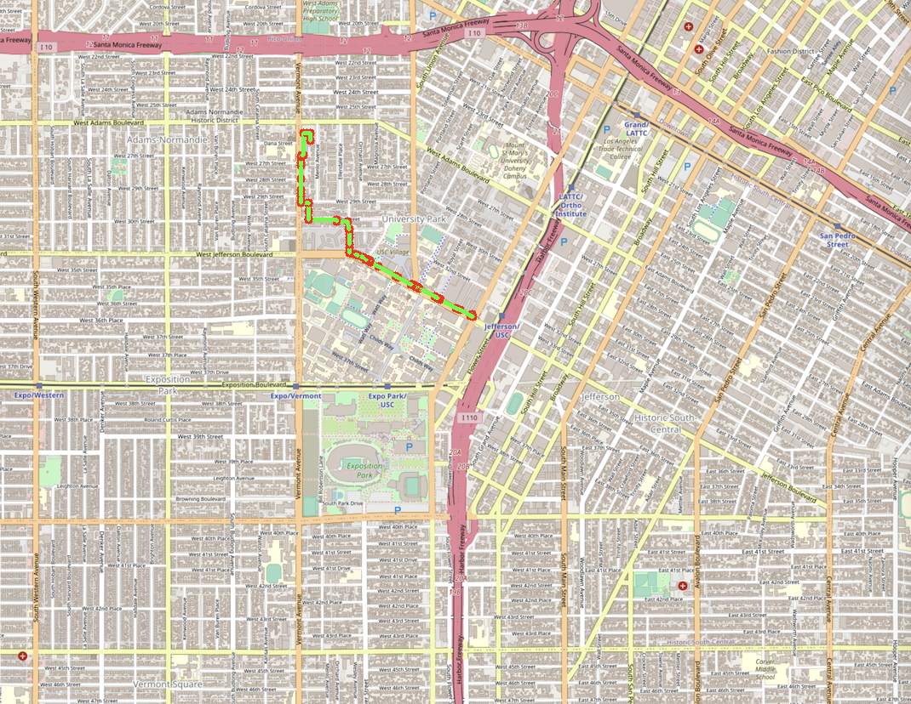</p>

Example 3:
```shell
* 6. CalculateShortestPath                                    
**************************************************************

Please input the start location:Holbox
Please input the destination:Chase     
*************************Dijkstra*****************************
*************************Results******************************
"6655857589","4872886231","4872886233","4872886234","7211629027","6815182444","544348508","441893821","123280934","4012759746","4012759747","123292045","123292100","9591449436","1378231753","2193435032","1841835270","9591448314","4015423959","7860380185","4015423960","4015423961","6813379493","3398574890","6814916510","5690152757","6814916518","3398574883","9559739232","9591449441",
The distance of the path is:0.539417 miles
**************************************************************
Time taken by function: 32 ms

*************************Bellman_Ford*************************
*************************Results******************************
"6655857589","4872886231","4872886233","4872886234","7211629027","6815182444","544348508","441893821","123280934","4012759746","4012759747","123292045","123292100","9591449436","1378231753","2193435032","1841835270","9591448314","4015423959","7860380185","4015423960","4015423961","6813379493","3398574890","6814916510","5690152757","6814916518","3398574883","9559739232","9591449441",
The distance of the path is:0.539417 miles
**************************************************************
Time taken by function: 16855 ms
```
<p align="center">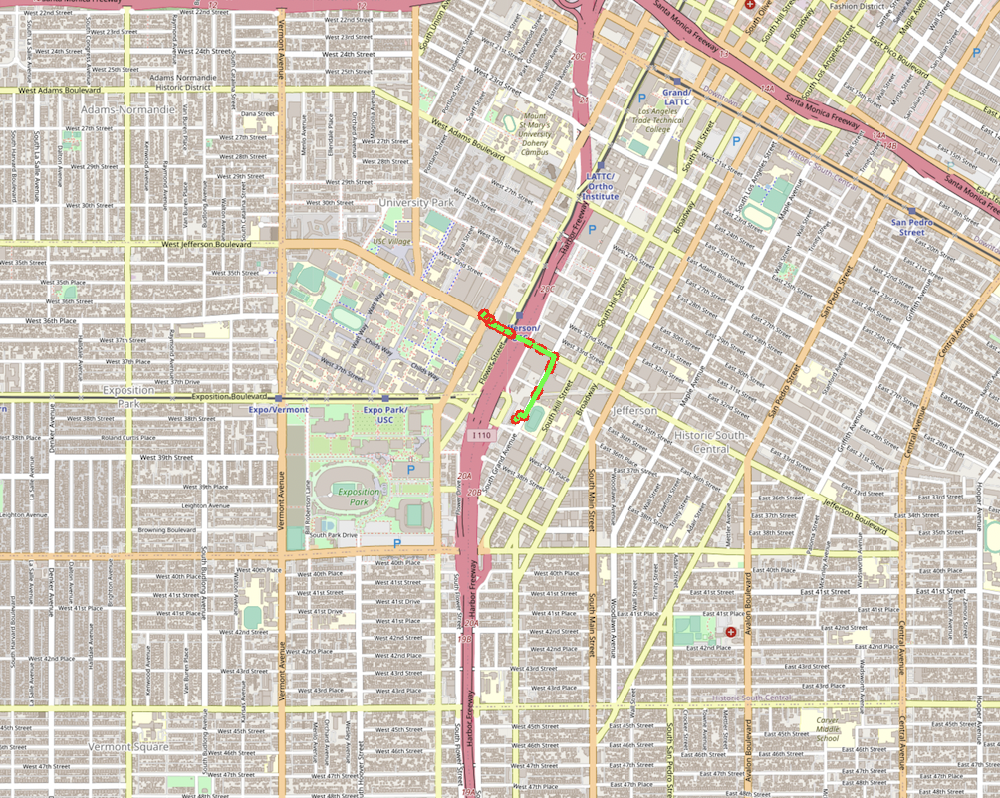</p>

Table:
| Point A to Point B      | Dijkstra | Bellman Ford|
| -------------------- | ----------- |-------|
| Ralphs to Target     |  58ms       | 14488ms    |
| Chase to Ralphs      |  152ms      | 17901ms    |
| Holbox to Chase      |  32ms       | 16855ms    |

## Item 7: Cycle Detection (Phase 2)

```c++
bool CycleDetection(std::vector<double> &square);
```

In this section, we use a square-shaped subgraph of the original graph by using four coordinates stored in ```std::vector<double> square```, which follows the order of left, right, upper, and lower bounds. 

Then try to determine if there is a cycle path in the that subgraph.
If it does, return true and report the path of the cycle on the map. Otherwise return false.

Method:
1. inSquare function checks whether one node is in the square and GetSubgraph function gets all of nodes in the square.
2. We create a helper function to detect whether there is a circle based on DFS algorithm. We mark the visited nodes and when the child node is not parent node and it is visited, there is a circle.
3. We traverse all nodes to run helper function to detect circle.
   
Example 1:
```
* 7. Cycle Detection                                          
**************************************************************

Please input the left bound longitude(between -118.320 and -118.250):-118.320
Please input the right bound longitude(between -118.320 and -118.250):-118.250
Please input the upper bound latitude(between 34.000 and 34.040):34.040
Please input the lower bound latitude(between 34.000 and 34.040):34.000
*************************Results******************************
there exists a cycle in the subgraph 
**************************************************************
Time taken by function: 0 ms
```
<p align="center">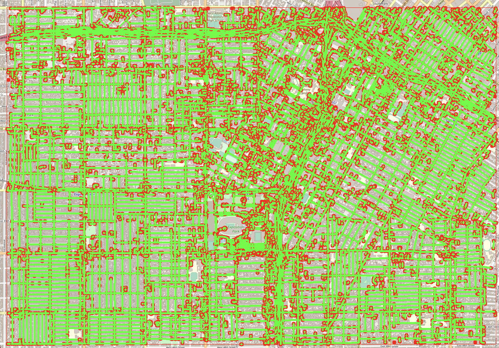</p>

Example 2:
```
* 7. Cycle Detection                                          
**************************************************************

Please input the left bound longitude(between -118.320 and -118.250):-118.300
Please input the right bound longitude(between -118.320 and -118.250):-118.270
Please input the upper bound latitude(between 34.000 and 34.040):34.030
Please input the lower bound latitude(between 34.000 and 34.040):34.000
*************************Results******************************
there exists a cycle in the subgraph 
**************************************************************
Time taken by function: 0 ms
```
<p align="center">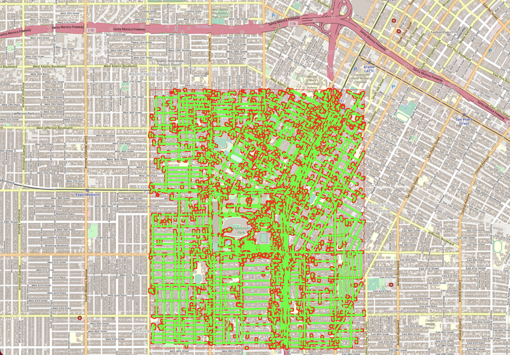</p>

Example 3:
```
* 7. Cycle Detection                                          
**************************************************************

Please input the left bound longitude(between -118.320 and -118.250):-118.289
Please input the right bound longitude(between -118.320 and -118.250):-118.250
Please input the upper bound latitude(between 34.000 and 34.040):34.036
Please input the lower bound latitude(between 34.000 and 34.040):34.010
*************************Results******************************
there exists a cycle in the subgraph 
**************************************************************
Time taken by function: 0 ms
```
<p align="center">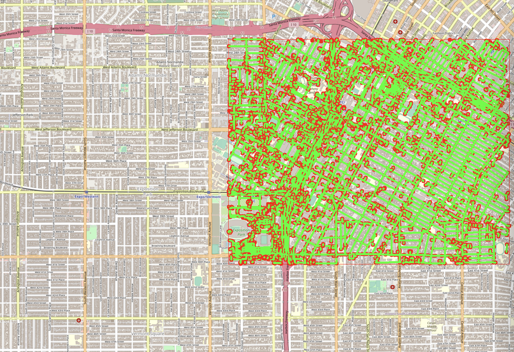</p>

Example 4:
```
* 7. Cycle Detection                                          
**************************************************************

Please input the left bound longitude(between -118.320 and -118.250):-118.315
Please input the right bound longitude(between -118.320 and -118.250):-118.277
Please input the upper bound latitude(between 34.000 and 34.040):34.028
Please input the lower bound latitude(between 34.000 and 34.040):34.009
*************************Results******************************
there exists a cycle in the subgraph 
**************************************************************
Time taken by function: 0 ms
```
<p align="center">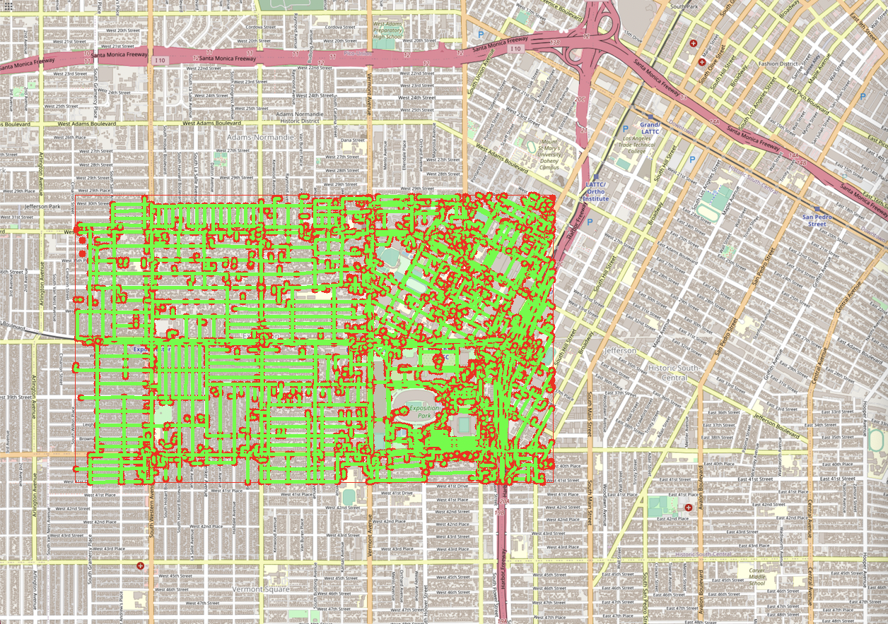</p>

Example 5:
```
* 7. Cycle Detection                                          
**************************************************************

Please input the left bound longitude(between -118.320 and -118.250):-118.300
Please input the right bound longitude(between -118.320 and -118.250):-118.273
Please input the upper bound latitude(between 34.000 and 34.040):34.038
Please input the lower bound latitude(between 34.000 and 34.040):34.029
*************************Results******************************
there exists a cycle in the subgraph 
**************************************************************
Time taken by function: 0 ms
```
<p align="center">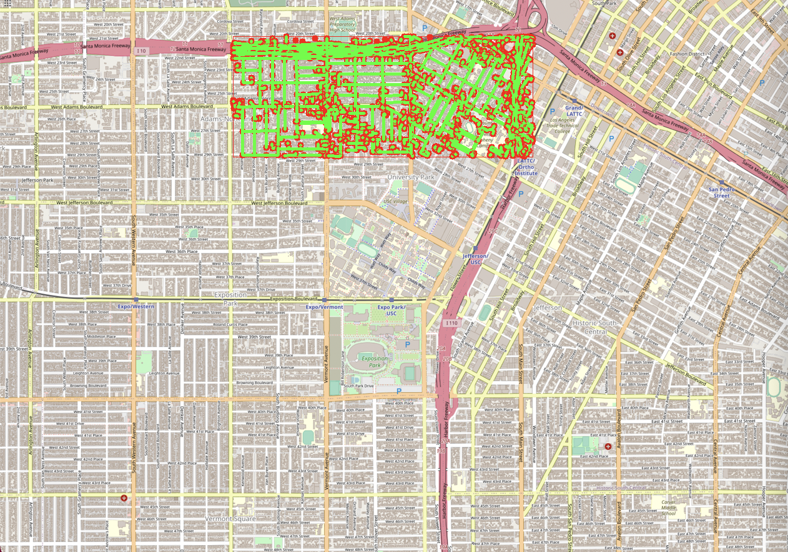</p>

**Your report should include at least five examples.**

## Item 8: Topological Sort (Phase 2)

```c++
std::vector<std::string> DeliveringTrojan(std::vector<std::string> &location_names,
                                            std::vector<std::vector<std::string>> &dependencies);
```
In this section, we assume that we are using a UAV which means we can fly directly from 1 point to another point. Tommy Trojan got a part-time job from TrojanEats, for which he needs to pick up and deliver food from local restaurants to various location near the campus. Tommy needs to visit a few different location near the campus with certain order, since there are some constraints. For example, he must first get the food from the restaurant before arriving at the delivery point. 

The TrojanEats app will have some instructions about these constraints. So, Tommy asks you to help him figure out the feasible route!

Here we will give you a vector of location names that Tommy needs to visit, and also some dependencies between those locations.


For example, 

```shell
Input: 
location_names = {"Ralphs", "Chick-fil-A", "KFC"}
dependencies = {{"Ralphs","KFC"}, {"Ralphs","Chick-fil-A"}, {"Chick-fil-A", "KFC"}}
```

Here, ```{"Ralphs","KFC"}``` means
that Tommy must go to `Ralphs` prior to `KFC`.

Your output should be:
```shell
Output: Ralphs  -> Chick-fil-A -> KFC
```
Also, we provide ```PlotPointsOrder``` function that can visualize the results on the map. It will plot each location name and also some arrowed lines to demonstrate a feasible route.

If no feasible route exists, you could simply return an empty vector.

Hint:
- You also need to finish ```ReadLocationsFromCSVFile``` and ```ReadDependenciesFromCSVFile``` functions, so you could read and parse data from you own CSV files. We also give two sample CSV files under ```input``` folder, which could be a reference. 
- When it asks you filenames, you need to give the absolute path.
- If you do not have ```ReadLocationsFromCSVFile``` and ```ReadDependenciesFromCSVFile``` functions ready yet, you can just press enter when it asks you filenames. It will call the default locations and dependencies.
- The locations are actually nodes, and the dependencies could be directed edges. You may want to first construct a DAG and then implement topological sort algorithm to get the route.

Method:
1. Finish ReadLocationsFromCSVFile and ReadDependenciesFromCSVFile function to read location and dependencies.
2. Create an unordered map: Edge_map to store adjacency infomation.
3. Create a circle detection function for directed graph.
4. Inplement topological sorting helper function based on DFS algorithm. This will traverse all nodes by dependencies.
5. We traverse all nodes to run helper function to perform topological sorting.
   
Note
- **Your report should show several examples of topological sort with at least 5 to 10 nodes.**


Below is an example output of 3 nodes
```shell
*************************Results******************************
Topological Sorting Results:
Ralphs
Chick-fil-A
KFC
**************************************************************
Time taken by function: 2 ms
```
<p align="center"></p>

In the user interface, we read the locations and dependencies from `topologicalsort_dependencies.csv` and `topologicalsort_locations.csv` to modify your input there.
Example1:
```
* 8. Topological Sort                                         
**************************************************************

Please input the locations filename:/Users/mingbei/Desktop/summer22-project-bming1/input/topologicalsort_locations.csv
Please input the dependencies filename:/Users/mingbei/Desktop/summer22-project-bming1/input/topologicalsort_dependencies.csv
*************************Results******************************
Topological Sorting Results:
Ralphs
Chick-fil-A
KFC
**************************************************************
Time taken by function: 1 ms
```
<p align="center">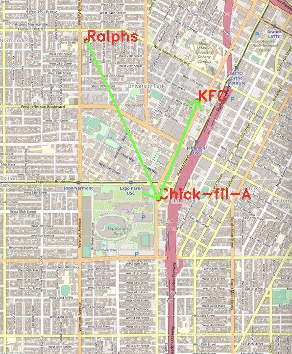</p>

Example 2:
```
* 8. Topological Sort                                         
**************************************************************

Please input the locations filename:/Users/mingbei/Desktop/summer22-project-bming1/input/test1_l.csv
Please input the dependencies filename:/Users/mingbei/Desktop/summer22-project-bming1/input/test1_d.csv
*************************Results******************************
Topological Sorting Results:
Kaitlyn
Adams Normandie Historic District
Ralphs
Chick-fil-A
KFC
**************************************************************
Time taken by function: 0 ms
```
<p align="center">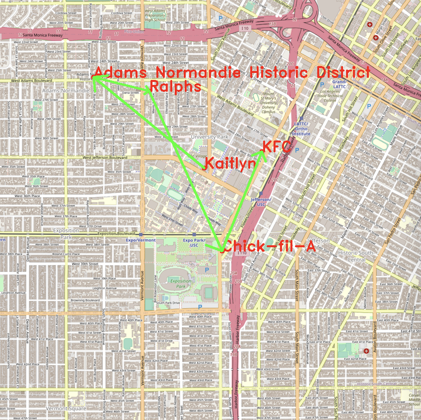</p>

Example 3:
```
* 8. Topological Sort                                         
**************************************************************

Please input the locations filename:/Users/mingbei/Desktop/summer22-project-bming1/input/test2_l.csv            
Please input the dependencies filename:/Users/mingbei/Desktop/summer22-project-bming1/input/test2_d.csv
*************************Results******************************
Topological Sorting Results:
Venice & Figueroa
Washington & Westmoreland
Cognoscenti Coffee Roastery
Ralphs
Venice & Flower
Chick-fil-A
KFC
Kaitlyn
Grand & 30th
Adams Normandie Historic District
**************************************************************
Time taken by function: 0 ms
```
<p align="center">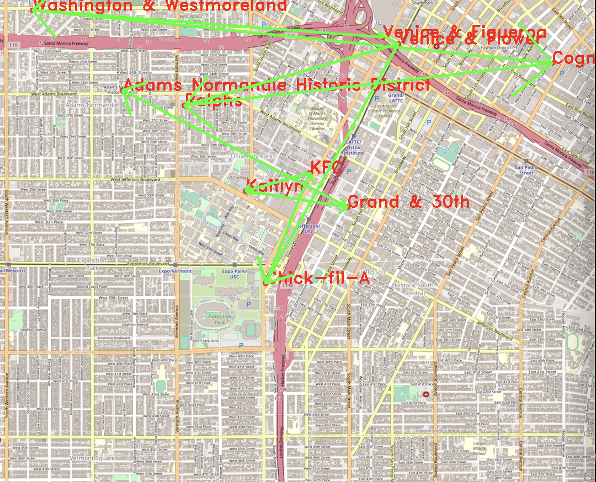</p>

## Item 9: The Traveling Trojan Problem (AKA Traveling Salesman!) (Phase 3)

In this section, we assume that we are using a UAV which means we can fly directly from 1 point to another point. Given a vector of location ids, assume every location can reach all other locations in the vector (i.e. assume that the vector of location ids is a complete graph).
Find the shortest route that covers all the locations exactly once and goes back to the start point. 

You will need to return the progress to get the shortest route which will then be converted to an animation.  

We will use the following algorithms:

- Brute-force (i.e. generating all permutations, and returning the minimum)
```c++
std::pair<double, std::vector<std::vector<std::string>>> TravelingTrojan_Brute_force(
      std::vector<std::string> location_ids);
```
- Brute-force enhanced with early backtracking
```c++
std::pair<double, std::vector<std::vector<std::string>>> TravelingTrojan_Backtracking(
      std::vector<std::string> location_ids);
```
- [2-opt Heuristic](https://en.wikipedia.org/wiki/2-opt). Also see [this paper](http://cs.indstate.edu/~zeeshan/aman.pdf)
```c++
std::pair<double, std::vector<std::vector<std::string>>> TravelingTrojan_2opt(
      std::vector<std::string> location_ids);
```

We use early backtracking when the current cost is higher than current minimum.

Please report and compare the time spent by these 3 algorithms. 2-opt algorithm may not get the optimal solution. Please show how far your solution is from the optimal solution.

Show the routes on the map. For each intermediate solution, create a new plot. Your final video presentation should include the changes to your solution.

We will randomly select N points in the map and run your program.

Methods for Brute force and Brute force with backtracking:
1. We create a helper function TravellingTrojan_helper to set base case and determine whether use backtracking or not. If using backtracking, we will not go deep if current cost is bigger than the stored cost. Then we traverse all nodes to find the path that has minimum cost.
2. In the TravelingTrojan_Brute_force and TravelingTrojan_Backtracking function, we start from the first node and set the isBacktracking condition to run the helper function.
   
Methods for 2-opt:
1. We use TwoOptSwap function to inverse the order of certain nodes.
2. In the TravelingTrojan_2opt, we set 2 loops to travel i and j nodes as inversed order nodes for all nodes, and compare their costs to find the minimum cost path.
```shell
**************************************************************
* 9. Traveling salesman problem                              
**************************************************************

In this task, we will select N random points on the map and you need to find the path to travel these points and back to the start point.

Please input the number of the places:8
"8201681442","6197156485","7786565237","6820972477","6807600525","1832234142","6819144993","1873055949",
Calculating ...
*************************Results******************************
TravelingTrojan_Brute_force
"8201681442","1873055949","6197156485","1832234142","6807600525","6819144993","7786565237","6820972477","8201681442",
The distance of the path is:7.94756 miles
**************************************************************
You could find your animation at src/lib/output.avi.          
Time taken by function: 59 ms

Calculating ...
*************************Results******************************
TravelingTrojan_Backtracking
"8201681442","6820972477","7786565237","6819144993","6807600525","1832234142","6197156485","1873055949","8201681442",
The distance of the path is:7.94756 miles
**************************************************************
You could find your animation at src/lib/output_backtracking.avi.
Time taken by function: 20 ms

Calculating ...
*************************Results******************************
TravelingTrojan_2opt
"8201681442","1873055949","6197156485","1832234142","6807600525","6819144993","7786565237","6820972477","8201681442",
The distance of the path is:7.94756 miles
**************************************************************
You could find your animation at src/lib/output_2opt.avi.     
Time taken by function: 0 ms
```
<p align="center"></p>

<p align="center"></p>

Example 1:
```
* 9. Traveling salesman problem                              
**************************************************************

In this task, we will select N random points on the map and you need to find the path to travel these points and back to the start point.

Please input the number of the places:8
"6788402767","123241963","7225140903","8410844387","6804857547","4835551066","8566199543","2514541803",
Calculating ...
*************************Results******************************
TravelingTrojan_Brute_force
"6788402767","7225140903","4835551066","123241963","8410844387","6804857547","2514541803","8566199543","6788402767",
The distance of the path is:6.97948 miles
**************************************************************
You could find your animation at src/lib/output0.avi.          
Time taken by function: 40 ms

Calculating ...
*************************Results******************************
TravelingTrojan_Backtracking
"6788402767","7225140903","4835551066","123241963","8410844387","6804857547","2514541803","8566199543","6788402767",
The distance of the path is:6.97948 miles
**************************************************************
You could find your animation at src/lib/output0_backtracking.avi.
Time taken by function: 20 ms

Calculating ...
*************************Results******************************
TravelingTrojan_2opt
"6788402767","7225140903","4835551066","123241963","8410844387","6804857547","2514541803","8566199543","6788402767",
The distance of the path is:6.97948 miles
**************************************************************
You could find your animation at src/lib/output0_2opt.avi.     
Time taken by function: 8 ms
```
<p align="center">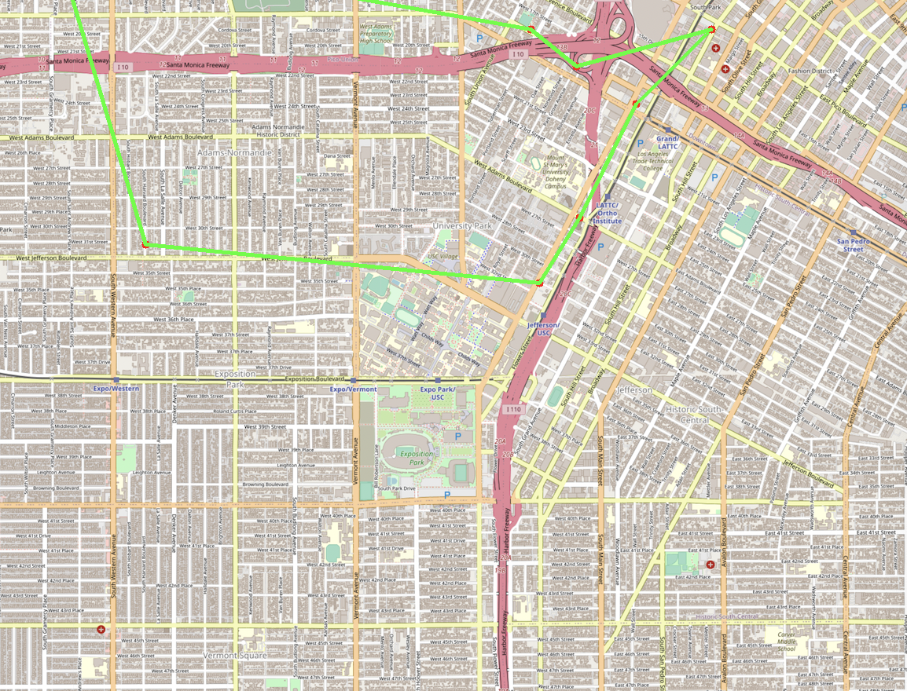</p>

Brute_force:
<p align="center">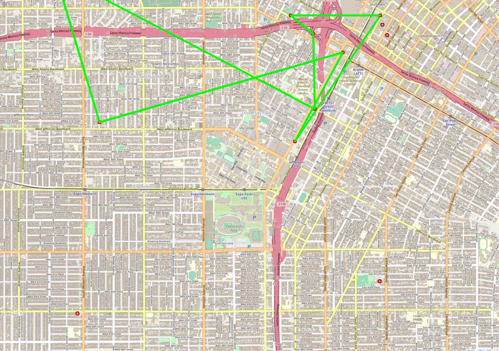</p>

Backtracking:
<p align="center"></p>

2opt:
<p align="center"></p>

Example 2:
```
* 9. Traveling salesman problem                              
**************************************************************

In this task, we will select N random points on the map and you need to find the path to travel these points and back to the start point.

Please input the number of the places:9
"9559677951","6696867982","7465955081","6987230638","4020099333","6805686618","122670346","6787728649","6816781772",
Calculating ...
*************************Results******************************
TravelingTrojan_Brute_force
"9559677951","4020099333","122670346","6787728649","7465955081","6987230638","6805686618","6696867982","6816781772","9559677951",
The distance of the path is:11.9187 miles
**************************************************************
You could find your animation at src/lib/output0.avi.          
Time taken by function: 345 ms

Calculating ...
*************************Results******************************
TravelingTrojan_Backtracking
"9559677951","4020099333","122670346","6787728649","7465955081","6987230638","6805686618","6696867982","6816781772","9559677951",
The distance of the path is:11.9187 miles
**************************************************************
You could find your animation at src/lib/output0_backtracking.avi.
Time taken by function: 97 ms

Calculating ...
*************************Results******************************
TravelingTrojan_2opt
"9559677951","4020099333","122670346","6787728649","7465955081","6987230638","6805686618","6696867982","6816781772","9559677951",
The distance of the path is:11.9187 miles
**************************************************************
You could find your animation at src/lib/output0_2opt.avi.     
Time taken by function: 11 ms
```

Brute_force:
<p align="center"></p>

Backtracking:
<p align="center">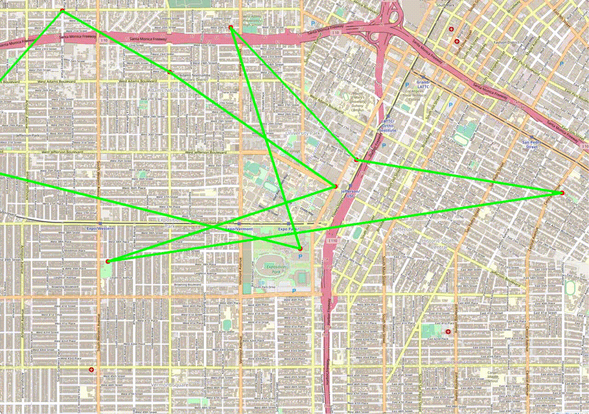</p>

2opt:
<p align="center"></p>

Example 3:
```
* 9. Traveling salesman problem                              
**************************************************************

In this task, we will select N random points on the map and you need to find the path to travel these points and back to the start point.

Please input the number of the places:10
"123182704","8862673115","8566227339","6819288802","9561765216","4583257829","6808276781","7863630713","4640058005","8474272878",
Calculating ...
*************************Results******************************
TravelingTrojan_Brute_force
"123182704","6808276781","4640058005","6819288802","8566227339","8862673115","9561765216","8474272878","7863630713","4583257829","123182704",
The distance of the path is:9.82917 miles
**************************************************************
You could find your animation at src/lib/output0.avi.          
Time taken by function: 3137 ms

Calculating ...
*************************Results******************************
TravelingTrojan_Backtracking
"123182704","6808276781","4640058005","6819288802","8566227339","8862673115","9561765216","8474272878","7863630713","4583257829","123182704",
The distance of the path is:9.82917 miles
**************************************************************
You could find your animation at src/lib/output0_backtracking.avi.
Time taken by function: 574 ms

Calculating ...
*************************Results******************************
TravelingTrojan_2opt
"123182704","6819288802","6808276781","4640058005","8566227339","8862673115","9561765216","8474272878","7863630713","4583257829","123182704",
The distance of the path is:9.94575 miles
**************************************************************
You could find your animation at src/lib/output0_2opt.avi.     
Time taken by function: 15 ms
```

Brute_force:
<p align="center">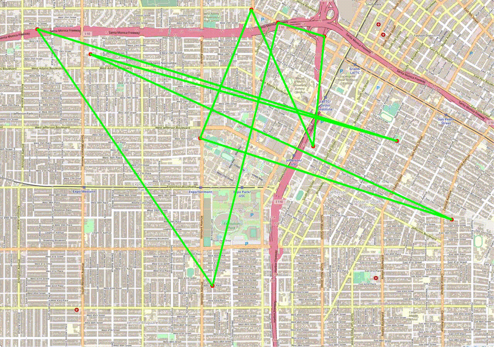</p>

Backtracking:
<p align="center"></p>

2opt:
<p align="center"></p>

Example 4:
```
* 9. Traveling salesman problem                              
**************************************************************

In this task, we will select N random points on the map and you need to find the path to travel these points and back to the start point.

Please input the number of the places:11
"6816800249","4835549609","8344672873","3396365189","8832489164","7279484757","1855166283","3659478909","6693451972","3398621876","1732340077",
Calculating ...
*************************Results******************************
TravelingTrojan_Brute_force
"6816800249","1855166283","6693451972","8832489164","8344672873","3398621876","3659478909","7279484757","4835549609","1732340077","3396365189","6816800249",
The distance of the path is:7.84625 miles
**************************************************************
You could find your animation at src/lib/output0.avi.          
Time taken by function: 35217 ms

Calculating ...
*************************Results******************************
TravelingTrojan_Backtracking
"6816800249","1855166283","6693451972","8832489164","8344672873","3398621876","3659478909","7279484757","4835549609","1732340077","3396365189","6816800249",
The distance of the path is:7.84625 miles
**************************************************************
You could find your animation at src/lib/output0_backtracking.avi.
Time taken by function: 2236 ms

Calculating ...
*************************Results******************************
TravelingTrojan_2opt
"6816800249","1855166283","6693451972","8832489164","8344672873","3398621876","3659478909","7279484757","4835549609","1732340077","3396365189","6816800249",
The distance of the path is:7.84625 miles
**************************************************************
You could find your animation at src/lib/output0_2opt.avi.     
Time taken by function: 22 ms
```

Brute_force:
<p align="center">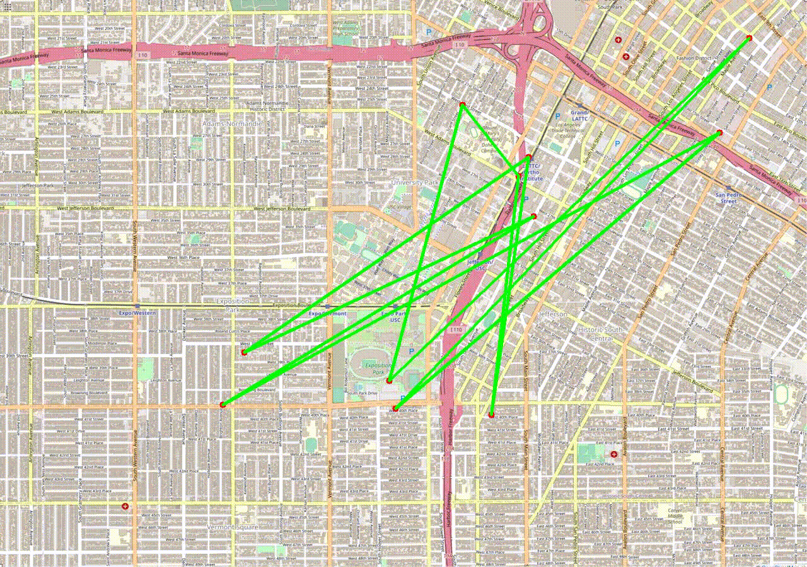</p>

Backtracking:
<p align="center"></p>

2opt:
<p align="center"></p>

Example 5:
```
* 9. Traveling salesman problem                              
**************************************************************

In this task, we will select N random points on the map and you need to find the path to travel these points and back to the start point.

Please input the number of the places:12
"6807245744","63051646","6788017726","3285243200","6790646126","6278441412","6816193701","4015486527","6814770363","1837207823","932378105","4872897511",
Calculating ...
*************************Results******************************
TravelingTrojan_Brute_force
"6807245744","4872897511","6814770363","6816193701","6788017726","4015486527","1837207823","932378105","6790646126","3285243200","6278441412","63051646","6807245744",
The distance of the path is:9.61752 miles
**************************************************************
You could find your animation at src/lib/output0.avi.          
Time taken by function: 430829 ms

Calculating ...
*************************Results******************************
TravelingTrojan_Backtracking
"6807245744","4872897511","6814770363","6816193701","6788017726","4015486527","1837207823","932378105","6790646126","3285243200","6278441412","63051646","6807245744",
The distance of the path is:9.61752 miles
**************************************************************
You could find your animation at src/lib/output0_backtracking.avi.
Time taken by function: 13027 ms

Calculating ...
*************************Results******************************
TravelingTrojan_2opt
"6807245744","4872897511","6814770363","6816193701","6788017726","4015486527","1837207823","932378105","6790646126","3285243200","6278441412","63051646","6807245744",
The distance of the path is:9.61752 miles
**************************************************************
You could find your animation at src/lib/output0_2opt.avi.     
Time taken by function: 27 ms
```

Brute_force:
<p align="center">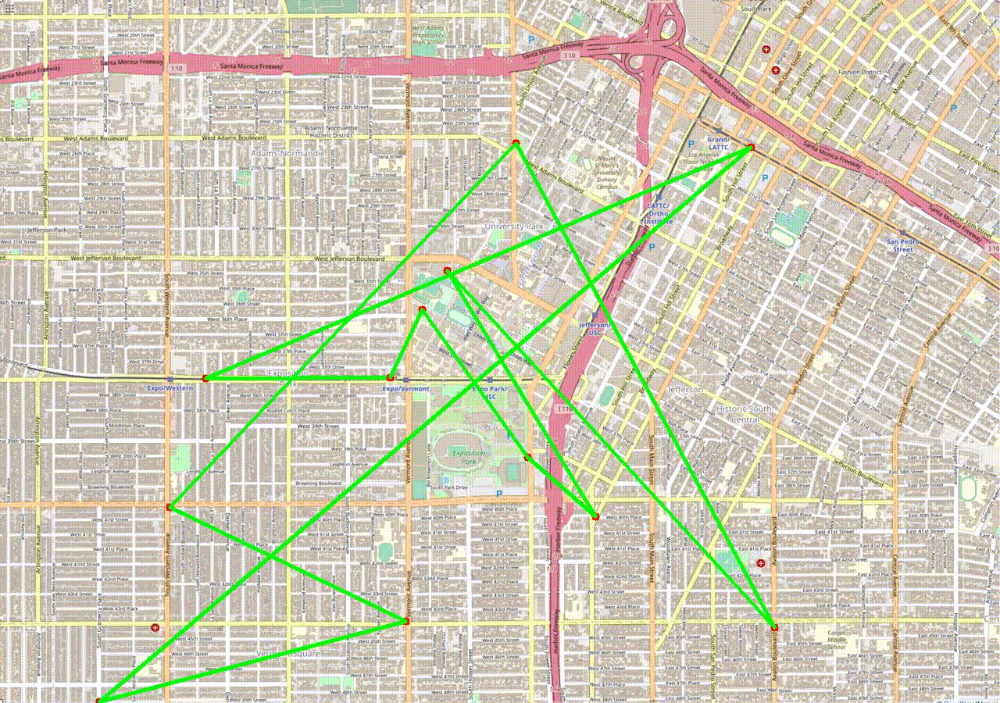</p>

Backtracking:
<p align="center"></p>

2opt:
<p align="center"></p>

Table :
| Number of nodes      | Brute_force | Backtracking | 2opt     |
| :-------------------- | :----------- |:--------------|:----------|
| 8                    |    40ms     | 20ms         |    8ms   |
| 9                    |    345ms    | 97ms         |    11ms  |
| 10                   |    3137ms   | 574ms        |    15ms  |
| 11                   |    35217ms  | 2236ms       |    22ms  |
| 12                   |    430829ms | 13027ms      |    27ms  |
## Item 10: Find Nearby (Phase 3)

Given an attribute name `C`, a location name `L` and a number `r` and `k`, find at most `k` locations in attribute `C` on the map near `L`(do not include `L`) with the range of `r` and return a vector of string ids. 

The order of locations should be from
nearest to farthest, and you should not include the current location. 

```c++
std::vector<std::string> TrojanMap::FindNearby(std::string attributesName, std::string name, double r, int k);
```

All attributes:
```
'artwork', 'attraction', 'bakery', 'bank', 'bar', 'beauty', 'beverages', 'bicycle', 'bicycle_rental', 'bus_station', 
'cafe', 'car', 'car_repair', 'car_wash', 'charging_station', 'childcare', 'clinic', 'clothes', 'confectionery', 
'convenience', 'copyshop', 'dentist', 'department_store', 'driving_school', 'fabric', 'fast_food', 'food_court', 
'fountain', 'fuel', 'gallery', 'hairdresser', 'hospital', 'hotel', 'library', 'marketplace', 'mobile_phone', 'museum', 
'music', 'optician', 'parcel_locker', 'parking', 'pharmacy', 'place_of_worship', 'police', 'post_office', 
'restaurant', 'school', 'shoe_repair', 'shoes', 
'skate', 'social_facility', 'supermarket', 'theatre', 
'tobacco', 'yes', 'yoga'
```


Please report and compare the time spent by this algorithm and show the points on the map.

Method:
1. We use a priority queue to define max heap for this problem.
2. Traverse all nodes to find whether it's centre or not. Calculate the distance between the centre node and nodes that satisfy the attributes. If the distance is less than radius, start k-nearest sorting.
3. At last, we reverse the result.
   
```shell
**************************************************************
* 10. Find Nearby                                    
**************************************************************

Please input the attribute:supermarket
Please input the locations:Ralphs
Please input radius r:10
Please input number k:10
*************************Results******************************
Find Nearby Results:
1 Trader Joes
2 Cal Mart Beer & Wine Food Store
3 Food 4 Less
**************************************************************
Time taken by function: 5 ms
```

<p align="center"></p>


## Reporting Runtime:
For each menu item, your program should show the time it took to finish each task.

Please make sure to provide various examples when you report the runtime. For example for topological sort, show an example with few nodes and another example with 10 or more nodes. The idea is to see how your runtime grows as input size grows.

## Runtime Comparison
For shortest path algorithms, you should compare solving the same problem with different algorithms (Dijkstra and Bellman-Ford). 
Please show the results on at least 3 different examples.

Similarly for the TSP problem, please provide various examples that show the runtime comparison. In particular, you should show at what point using the exhaustive search is not practical and compare the same input with the heuristic implementation.

**Please provide a table like below that compares the runtime of your algorithms for different number of nodes:**

| Number of nodes      | Time with algorithm 1 | Time with algorithm 2|
| -------------------- | ----------- |----|
|             |  t1        | t2    |

Your table should show have at least 15 rows.

## Report and Rubrics:

Your final project should be checked into Github. The [README.md](README.md) of your project is your report. 

### Report:

Your REPORT.md file should include four sections:
Please create a new REPORT.md file and write your report there.

1. High-level overview of your design (Use diagrams and pictures for your data structures).
2. Detailed description of each function and its time complexity.
3. Time spent for each function.
4. Discussion, conclusion, and lessons learned.

### Rubrics:

- Item 1 (AutoComplete): 1 point. (Phase 1)
- Item 2-1 (GetPosition): 1 point. (Phase 1)
- Item 2-2 (EditDistance): 10 points. (Phase 2)
- Item 3 (GetAllCategories): 3 Points. (Phase 2)
- Item 4 (GetAllLocationsFromCategory): 5 Points. (Phase 2)
- Item 5 (GetLocationRegex): 5 Points. (Phase 2)
- Item 6 (Shortest path): 15 points. (Phase 2)
   - Bellman-Ford implementation
   - Dijkstra implementation
   - Table/Plot for comparison, and measure and report time spent by two algorithms.
- Item 7 (Cycle detection): 5 points. (Phase 2)
   - Boolean value and draw the cycle if there exists one.
- Item 8 (Topological Sort): 5 points (Phase 2)
   - Check whether there exist a topological sort or not
   - Return the correct order and plot those point on the map
- Item 9 (Traveling Trojan) (Phase 3)
   - Brute-force: 5 points.
   - Brute-force enhanced with early backtracking: 5 points.
   - 2-opt: 10 points.
   - Animated plot: 5 points.
- Item 10 (FindNearby): 5 points. (Phase 3)
   - Return the correct ids and draw the points.
- Creating reasonable unit tests: 10 points.
      - Three different unit tests for each function.
- Video presentation and report: 10 points. (Phase 3)


## Extra credit items: Maximum of 20 points:
   1. Implementation of [3-opt](http://cs.indstate.edu/~zeeshan/aman.pdf): 10 points.
   2. [Genetic algorithm](https://www.geeksforgeeks.org/traveling-salesman-problem-using-genetic-algorithm/) implementation for Traveling Trojan: 10 points
   3. Create dynamic and animated UI using [ncurses](https://en.wikipedia.org/wiki/Ncurses): 10 points
      - Uncomment #define NCURSES in main.cc and mapui.h
      - Create your menu in DynamicPrintMenu().
      - You could check https://github.com/ourarash/ncurses_bazel
      - Please develope your own UI.
      - Example
         <p align="center"></p>
               
   4. Accurate measurement of your algorithm runtime using [Google Benchmark](https://www.youtube.com/watch?v=9VKR8u9odrA) while sweeping the input size and providing a diagram of how the runtime grows based on the input size: 10 points.

